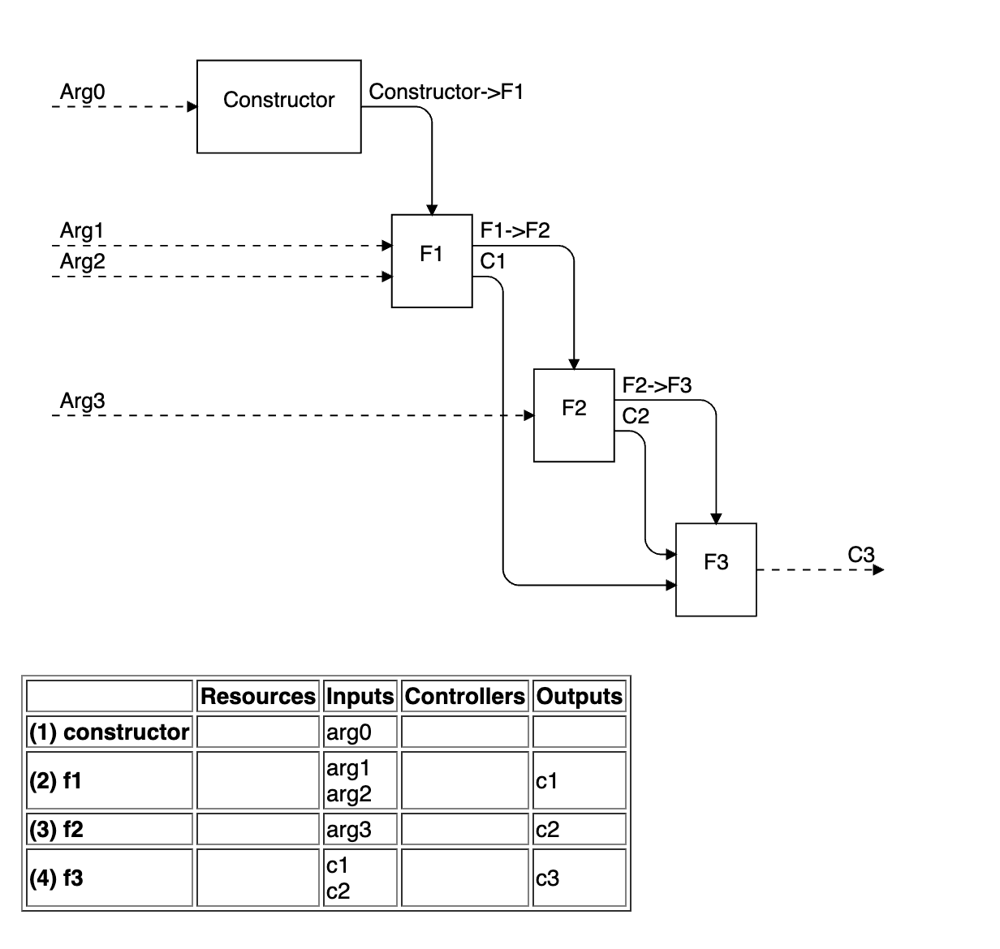

# FindFunc

FindFunc is a DSL that generates IDEF0-Like diagram and metric of IDEF0 building blocks.

## Applications

Business process
Solution components

## The language

### For Architect, System Modeler, Citizen Developer

#### Input

```java
idef0 ExampleProject

@InputConcept
@OutputConcept
@ResourceConcept
@FinalOutputConcept

func Function1
	in InputConcept
	out OutputConcept
	res ResourceConcept

func Function2
	out FinalOutputConcept
	ctrl OutputConcept

view View1 < Function1 Function2
view View2 < Function1
view View3 < Function2
```

#### Output


### For Typescript Developer

#### Input

```typescript
//%model TypescriptClass
//%view v1 < constructor f1 f2 f3
class TypescriptClass {
  //%c1
  c1: number;
  //%c2
  c2: number;
  //%c3
  c3: number;

  //%func constructor < arg0 -> f1
  //%arg0
  constructor(arg0: number) {
    this.f1(arg0, arg0);
  }

  //%func f1 < arg1 arg2 > c1 ->f2
  //%arg1
  //%arg2
  f1(arg1: number, arg2: number) {
    this.c1 = arg1 + arg2;
    this.f2(10);
  }

  //%func f2 < arg3 > c2 -> f3
  //%arg3
  f2(arg3: number) {
    this.c2 = this.c2 * arg3;
    this.f3();
  }

  //%func f3 < c1 c2 > c3
  f3() {
    this.c3 = this.c1 + this.c2;
  }
}
```

#### Output



# Install and Run example projects

You will have to install the following software on your computer

- [Ruby v2.6+](https://www.ruby-lang.org/en/downloads/)
- [Node.js v12.14+ Npm v6.14+](https://nodejs.org/en/download/)
- [Java v1.8+](https://www.oracle.com/java/technologies/javase-jre8-downloads.html)

```
git clone git@github.com:vorachet/FindFuncDSL.git

cd FindFuncDSL

npm install

DSL_SRC_FOLDERS=./projects TYPESCRIPT_SRC_FOLDERS=./src npm start
```

If the server can be started successfully, the browser will automatically launch in this step.


# The workflow

## Start the server

```
npm start
```

## Create your FindFuncDSL project

In order to work on multiple FindFuncDSL projects, save your DSL files in `projects` folder.

FindFuncDSL provides a convenient feature that runs the DSL compiler along with the built-in HTTP server to monitor your DSL files for any changes and generation tasks.

Example DSL files

- [MaintainReparableSpares.idef0](projects/MaintainReparableSpares.idef0)
- [Pizza.idef0](projects/Pizza.idef0)
- [ProjectPlan.idef0](projects/ProjectPlan.idef0)
- [SweKernel.idef0](projects/SweKernel.idef0)

# Acknowledgement

This project-based learning program is funded by the School of Information Technology, King Mongkut's University of Technology Thonburi

#### Software building blocks

The list of software projects that help build FindFuncDSL.

- [Eclipse Xtext](https://www.eclipse.org/Xtext/), [jimmyjazz/IDEF0-SVG](https://github.com/jimmyjazz/IDEF0-SVG), [tapio/live-server](https://github.com/tapio/live-server), [paulmillr/chokidar](https://github.com/paulmillr/chokidar)

#### License

MIT (c) School of Information Technology, King Mongkut's University of Technology Thonburi, see [LICENSE](LICENSE) file and https://opensource.org/licenses/MIT.
