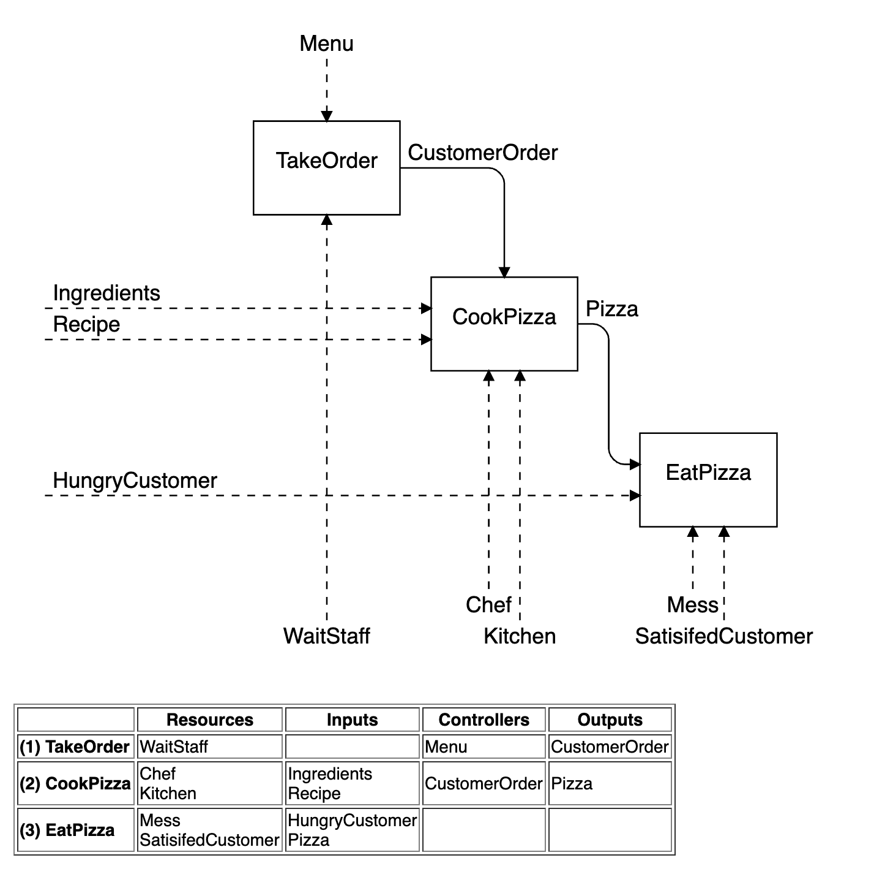

# FindFunc

FindFunc is a DSL that generates IDEF0-Like diagram and metric of IDEF0 building blocks.

This project-based learning program is funded by the School of Information Technology, King Mongkut's University of Technology Thonburi - [visit SIT research group](https://www.sit.kmutt.ac.th/sit-research/).

You will have to install the following software on your computer

- [Ruby v2.6+](https://www.ruby-lang.org/en/downloads/)
- [Node.js v12.14+ Npm v6.14+](https://nodejs.org/en/download/)
- [Java v1.8+](https://www.oracle.com/java/technologies/javase-jre8-downloads.html)

# Install and Run example projects

```
git clone git@github.com:vorachet/FindFuncDSL.git

cd FindFuncDSL

npm install

npm start
```

FindFuncDSL provides a convenient feature that runs the DSL compiler along with the built-in HTTP server to monitor your DSL files for any changes and generation tasks.

If the server can be started successfully, the browser will automatically launch in this step.





# The workflow

## Start the server

```
npm start
```

## Create your FindFuncDSL project

In order to work on multiple FindFuncDSL projects, save your DSL files in `projects` folder.

The reserved words that cannot be used as an {identifier}

- idef0
- concepts
- func
- view
- title

```
idef0 ExampleProject
set genUI
concepts
	InputConcept  OutputConcept
	ResourceConcept  FinalOutputConcept

func Function1 (
	receives InputConcept
	produces OutputConcept
	requires ResourceConcept
)

func Function2 (
	produces FinalOutputConcept
	respects OutputConcept
)

view View1 title "My View1" funcs (Function1 Function2)

view View2 title "My View2" funcs (Function1)

view View3 title "My View3" funcs (Function2)

```


Example DSL files

- [MaintainReparableSpares.idef0](projects/MaintainReparableSpares.idef0)
- [Pizza.idef0](projects/Pizza.idef0)
- [ProjectPlan.idef0](projects/ProjectPlan.idef0)
- [SweKernel.idef0](projects/SweKernel.idef0)

#### Maintainer

- Vorachet Jaroensawas (vorachet@gmail.com)
